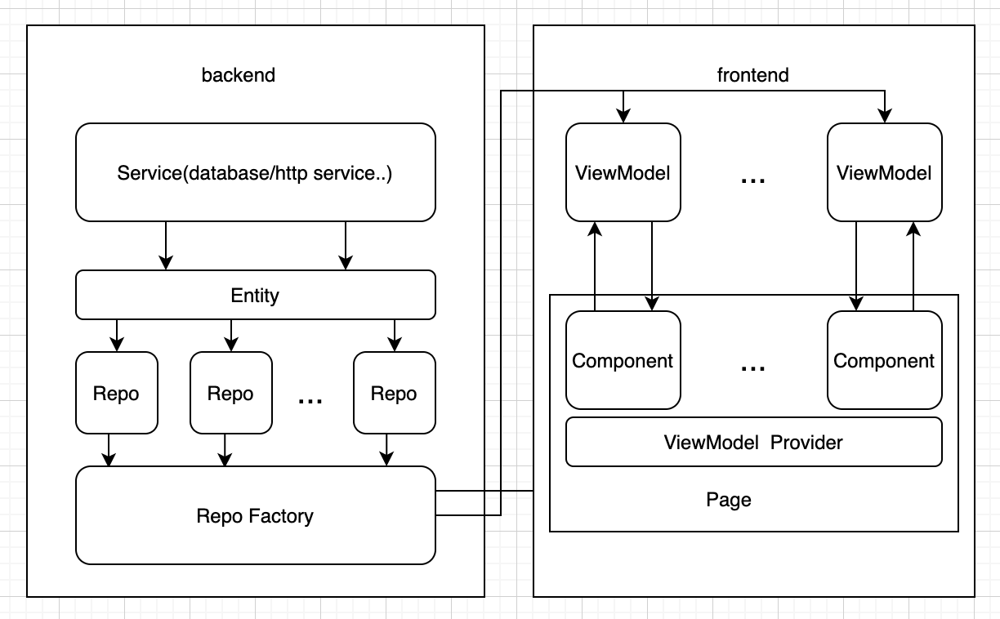

# flutter_todo_app

用 Flutter 编写的一个简单todo应用

### 功能

- 添加待办任务
- 删除待办任务
- 修改待办任务
- 完成待办任务
- 完成后的任务自动沉底，保证未完成任务始终在上面

参考 demo 文件夹中的演示视频

### 安装包

可以在release中找到，也可以在demo文件夹中找到

- Android： demo/android/下有两个apk，如果要在x86模拟器上安装请使用 app-debug-emulator.apk，原因参见[flutter 支持的架构](https://flutter.cn/docs/deployment/android#section-5)。真机可以安装app-release.apk
- iOS : demo/ios， 由于没有开发者账号无法打包，只能用debug包，可以用iPhone 12 pro模拟器拖拽安装

### 架构简介

采用前后分离，repo定义数据接口，上层通过 repo factory获取对应接口实例来进行访问

前端采用mvvm结构，每一个component UI组件绑定对应的viewmodel，组件间相互独立不进行依赖

页面对component UI组件进行组装，通过component所提供的controller进行通信

使用 provider 库所提供的能力在page中对各个组件的viewmodel进行注入

### 代码结构

- backend 
  - database: 数据库操作类
  - entity: 数据模型
  - repo：数据接口，定义抽象接口和实现，上层通过factory获取对应接口实例
- frontend
  - event: 事件同步以及具体事件的定义
  - ui:用户进行交互的模块
    - page：以页面为维度来进行分类
      - todo_list_page: 主页面，对component中的UI组件进行组合以及注入viewmodel，通过controller来控制组件的相互相应，让组件间可以完全独立
      - component 
        - add_task_component: 添加任务组件
        - delete_task_component: 删除任务组件
        - edit_task_component: 编辑任务组件
        - todo_list_view_component: 任务列表组件
        - controller：操作组件的控制器，可以用于组件间的通信
    - res: UI资源，例如字符串，颜色，dimensions等等
    - widget：与业务无关的通用UI基础组件
  - viewmodel:绑定view的数据驱动
    - base_view_model: Viewmodel 的封装类，封装了请求处理，事件订阅，view状态等
- main - 程序入口

单元测试：

- database 接口测试
- repo 的接口测试
- ViewModel 基类及各个viewmodel的逻辑测试

### 三方库

- floor: 类似jetpack Room 的数据库lib
- event_bus：提供了事件总线的基础支持
- provider：状态管理lib，在本项目中主要作用是为组件注入viewmodel
- flutter_easyloading: 提供loading UI的能力

